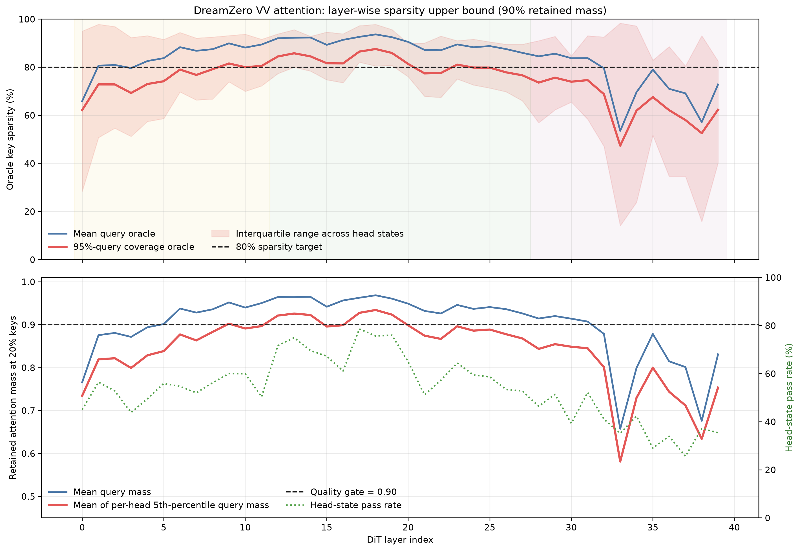

# VV Attention Sparsity Audit

This audit isolates `video-query -> video-key` self-attention. For each sampled query,
`m_q(S) = sum_{k in S} softmax(Q_v K_v^T / sqrt(d))_qk`.
The top-p oracle chooses the best keys independently for each query, so it is an optimistic
upper bound rather than the cost of a deployable shared mask.

## Dataset

- VV head-state records: 2,764,800
- Video keys per record: 7,920
- Query sampling: 32 video queries per head state
- Coverage: 8 DiT steps, 40 layers, 40 heads, both CFG branches

## Main results

| Measurement | Required keys | Implied key sparsity |
|---|---:|---:|
| Mean query, retain 90% mass | 16.62% | 83.38% |
| Cover 95% of queries in a head state, retain 90% mass (mean) | 25.24% | 74.76% |
| Same robust measurement, median head state | 18.13% | 81.87% |

At a fixed 20% key budget:

| Mean retained mass | Mean 5th-percentile query mass | Head-state pass rate (`p05 >= 0.90`) |
|---:|---:|---:|
| 0.9001 | 0.8428 | 53.58% |

## Layer-stage summary

| Layer stage | Keys for 95%-query coverage | Implied sparsity | p05 query mass at 20% keys | Pass rate |
|---|---:|---:|---:|---:|
| Early (0-11) | 24.86% | 75.14% | 0.8464 | 53.07% |
| Middle (12-27) | 18.13% | 81.87% | 0.9004 | 64.82% |
| Late (28-39) | 35.09% | 64.91% | 0.7624 | 39.11% |

## Fixed-budget table

| Keep ratio | Sparsity | Mean retained mass | Mean p05 query mass | Pass rate |
|---:|---:|---:|---:|---:|
| 10.00% | 90.00% | 0.8369 | 0.7488 | 32.58% |
| 20.00% | 80.00% | 0.9001 | 0.8428 | 53.58% |
| 25.00% | 75.00% | 0.9183 | 0.8707 | 61.82% |
| 35.00% | 65.00% | 0.9432 | 0.9100 | 73.22% |
| 50.00% | 50.00% | 0.9667 | 0.9472 | 83.91% |
| 75.00% | 25.00% | 0.9889 | 0.9825 | 94.46% |

## Interpretation

The VV matrix is meaningfully sparse, but a uniform 80% sparsity policy is unsafe:
roughly half of the head states fail the worst-query-tail mass gate. Middle layers are
the strongest sparse region, while late layers are substantially more diffuse. M1 should
therefore predict a continuous budget by step/layer/head and retain dense fallback.

## Reproducibility

- `vv_layer_sparsity.csv`: complete 40-layer table.
- `vv_fixed_budget_summary.csv`: fixed-budget quality table.
- `vv_layer_sparsity.pdf`: vector figure for the paper.
